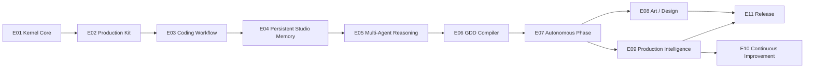

# WAL-K Work Breakdown Structure (WBS)

**Status:** Draft v1 (planning stage, 2026-10-05)
**Inputs:** `requirements/WAL_K_REQ.md` (cited `§NN`), `docs/01-architecture/*` (ARCHITECTURE, DOMAIN-MODEL, INTERFACES, ADR-0001…0013), `docs/00-governance/*`.
**Audience:** any implementing or reviewing agent. Start here, pick the lowest-numbered `TODO` story whose dependencies are `DONE`, follow `IMPLEMENTATION-PROTOCOL.md`.

Detail files (full STORY-TEMPLATE stories):

| Epic | File | Status of file |
|---|---|---|
| E01 | `EPIC-01-kernel-core.md` | written |
| E02 | `EPIC-02-production-kit.md` | written |
| E03 | `EPIC-03-coding-workflow.md` | written |
| E04 | `EPIC-04-persistent-studio-memory.md` | written |
| E05–E11 | `EPIC-05-…` … `EPIC-11-…` | to be written by the follow-up planner using the IDs fixed in §4 of this file |

---

## 1. ID scheme and task types

| Pattern | Type | Meaning |
|---|---|---|
| `Exx-Syy` | story (`feat`/`docs`/`chore`) | Implementable unit, 0.5–2 days, full STORY-TEMPLATE |
| `Exx-Ryy` | review task | Executed by a **different agent instance / model** than the implementer (IMPLEMENTATION-PROTOCOL "Reviewer protocol"). Acceptance criteria = DoD checks over the epic's stories. Defects become `bugfix` stories `Exx-Byy` appended to the epic file. |
| `Exx-Xyy` | refine task (`docs`) | Re-validates the epic's story file lists, interface references and dependencies against the codebase **at that time**; updates the epic file and this WBS. Mandatory first task of every epic from E05 on. |
| `Exx-Byy` | bugfix story | Created only by review tasks or a failing gate on `main`. |

Zero-padded two digits. IDs are never reused or renumbered once this file is committed; a dropped story keeps its row with status `DROPPED` and a reason.

---

## 2. Rules binding every epic

1. **Order.** Implement in ID order within an epic. A story never depends on a story in a later epic (STORY-TEMPLATE rule 4). Cross-epic dependencies point only backwards.
2. **Gate.** Every epic ends with the epic-gate story (the proving scenario, an e2e test under `tests/e2e/`) followed by `Rxx` review. The next epic may start only when the gate story is `DONE` and the review has produced no `BLOCKER` bugfix stories.
3. **Refine.** Every epic from E05 on starts with `X01 REFINE`: the planner re-reads the current `src/walk/` tree and `INTERFACES.md`, re-validates every story's Files table and dependencies, and commits the corrected epic file before any story starts.
4. **Branches.** E01–E03: commit directly to `main`, one commit per story (COMMIT-POLICY §4). From E04 on, or whenever two agents work concurrently: branch `story/<ID>-<slug>` + worktree, merge `--no-ff` after the epic review.
5. **Commit subjects** follow COMMIT-POLICY.md: `<type>: <subject> (<ID>)`, ≤ 72 chars, no attribution or signature lines (the `commit-msg` hook rejects `Co-Authored-By`, `Signed-off-by`, `Generated with/by`). Provider names are allowed in subjects, e.g. `feat: add codex cli model adapter (E01-S22)`.
6. **Names.** Only names defined in `docs/01-architecture/` are used. A story that must introduce a public name not defined there prefixes its Notes with `NEW NAME:`; §6 of this file lists them all so the architect can update the docs.
7. **Quality gate** (`CONVENTIONS.md` §5) green before every commit; coverage ≥ 90 % for touched modules, ≥ 85 % overall.
8. **Status upkeep.** The implementer updates the story's `Status` in the epic file **and** the row in §5 of this file in the same commit.

---

## 3. Planning conventions binding E01–E11 (resolve ambiguities once)

These decisions were taken while planning so that every epic file agrees. They are implementation-level (Autonomy Level 0 for the planner) except where marked `NEW NAME:` / `RELOCATE:`, which require an architecture-doc update.

### 3.1 Protocol vs implementation naming
- `src/walk/<pkg>/protocols.py` holds the `typing.Protocol` named exactly as in `INTERFACES.md` (e.g. `WorkflowManager`).
- `src/walk/<pkg>/service.py` holds the default implementation named **`Default<Protocol>`** (e.g. `DefaultWorkflowManager`, `DefaultLedgerManager`, `DefaultAgentExecutor`). Concrete providers/adapters keep their architecture names (`ClaudeAdapter`, `CodexAdapter`, `LocalWorkProvider`, `JiraWorkProvider`, `GitCliProvider`, `UnityBatchProvider`, `GraphifyProvider`).
- `NEW NAME:` the `Default*` prefix pattern (ARCHITECTURE §1.3 names only the protocol).

### 3.2 Model placement forced by the import table (ARCHITECTURE §2.2)
- `RELOCATE: Capability` → `src/walk/common/enums.py` (fifth cross-cutting enum). Reason: `agents.models.ModelPolicy.required_capabilities: list[Capability]` and `agents` may not import `model_router`. Needs an ADR-0009 D-1 amendment.
- `RELOCATE: EffortPolicy` → `src/walk/effort/models.py` (DOMAIN-MODEL §4.2 lists it under `agents`; `EffortManager.resolve(policy)` would otherwise force `effort → agents`).
- `RELOCATE: BudgetPolicy` → `src/walk/budgets/models.py` (same reason for `BudgetManager.ensure(policy)`).
- `ModelPolicy` stays in `agents.models`; `model_router` imports it (allowed).
- Value objects defined inside INTERFACES.md protocol blocks live in the package's `models.py`: `Transition`, `TransitionTable`, `TransitionContext`, `GuardResult` (workflow); `BudgetVerdict` (budgets); `RouteDecision`, `KernelStatus` (orchestrator); `RunSession`, `ProviderEffortConfig` (model_router); `WorkItemRef`, `CommitInfo`, `PullRequestRef`, `BuildTarget`, `JobResult`, `GraphNode`, `GraphEdge`, `GraphNeighborhood`, `AssetRequest`, `AssetJob`, `AssetProvenance` (integrations); `Report` (telemetry); `AppliedEffects` (runtime).
- `NEW NAME:` package-local exceptions required by INTERFACES docstrings: `walk.hooks.errors.HookFailed`, `walk.model_router.errors.BlockedProvider`, `walk.model_router.errors.NotResumable`, `walk.integrations.errors.NotSupported`. All derive from `walk.common.errors` classes (`HookFailed(PermanentError)`, `BlockedProvider(TransientError)`, `NotResumable(PermanentError)`, `NotSupported(PermanentError)`).

### 3.3 `walk.common` layout (E01-S01)
```
src/walk/common/__init__.py   re-exports below
src/walk/common/models.py     WalkModel, FrozenModel, utcnow, JsonDict, Actor
src/walk/common/ids.py        all Annotated id types (DOMAIN-MODEL §1.2), IdFactory (Protocol), new_ulid(), format_seq_id(prefix, n, width), parse_prefix(id)
src/walk/common/clock.py      Clock (Protocol: now() -> datetime), SystemClock
src/walk/common/errors.py     WalkError, TransientError(+ProviderUnavailable, RateLimited, Timeout, QuotaExhausted, ToolCrashed), PermanentError(+PermissionDenied, GuardRejected, OutputInvalid, BoundaryViolation, ConfigError), RecoverableInterruption
src/walk/common/roles.py      AgentRole
src/walk/common/enums.py      Effort, LearningScope, ImprovementScope, Capability (RELOCATE, §3.2)
```
`IdSequenceStore` (implements `IdFactory`) lives in `src/walk/persistence/ids.py` (satisfies CONVENTIONS §2 "IDs generated by `walk.persistence.ids`").

### 3.4 Guards and payload keys (E01-S09/S10)
Guards are pure predicates `Guard(item, ctx) -> GuardResult`. Facts that come from outside the work item are supplied by the kernel caller in `TransitionContext.payload` under fixed keys. All guards named in INTERFACES §3 are registered in E01 and read these keys:

| Payload key | Type | Written by | Read by guard(s) |
|---|---|---|---|
| `output_status` | `AgentOutputStatus` value | `OutputApplier` | `output_status_is_completed`, `output_status_is_approved` |
| `has_commit` | bool | `OutputApplier` | `has_commit` |
| `evidence_kinds_present` | list[`EvidenceKind`] | `OutputApplier`, CI step | `required_evidence_present`, `regression_test_evidence` |
| `ci_green` | bool | integration step (E03-S12) | `ci_green`, `ci_green_on_integration_branch` |
| `implementer_role`, `reviewer_role` | `AgentRole` | scheduler | `reviewer_role_differs` |
| `implementer_model_id`, `reviewer_model_id`, `cross_model_review` | str, str, bool | scheduler | `reviewer_model_differs_or_disabled` |
| `handover_present` | bool | `OutputApplier` | `handover_present` |
| `escalations_non_empty` | bool | `OutputApplier` | `escalations_non_empty` |
| `blocker_resolved` | bool | CLI / orchestrator | `blocker_resolved` |
| `resume_state` | `WorkItemState` value | `StateMachine` on `block` (ADR-0010 D-5) | `unblock` target resolution |
| `children_states` | dict[WorkItemId, WorkItemState] | `WorkflowManager` | `children_created`, `all_stories_integrated`, `rework_children_created`, `has_children_implementing` |
| `decision_id` | `DecisionId` | caller | `decision_recorded_quality` |
| `budget_ok` | bool | scheduler (`BudgetManager.can_afford`) | `budget_available` |
| `branch_available` | bool | scheduler / `GitProvider` | `branch_available` |
| `feature_context_sections` | list[str] | `MemoryManager` | `technical_design_section_present`, `root_cause_section_present` |
| `approved_artifact_ids` | list[str] | `MemoryManager` | `required_approved_artifacts_present` |
| `open_blocker_bug_count` | int | `WorkflowManager` | `no_open_blocker_bugs` |
| `phase_state` | `PhaseState` value | orchestrator | `phase_in_evidence_review`, `in_phase_scope` |
| `reproduction_evidence` | bool | QC output | `reproduction_no_longer_reproduces_evidence` |
| `max_fix_loops`, `max_reopen` | int | `RuntimePolicy`/project config (defaults 3) | `fix_loops_below_max`, `fix_loops_at_max`, `reopen_below_max`, `reopen_at_max` |

Guard **registry names** are snake_case identifiers (column "guard(s)" in INTERFACES §3 is normalised: `output_status == APPROVED` → `output_status_is_approved`; `fix_loops < max_fix_loops` → `fix_loops_below_max`; `all_stories_in(INTEGRATION∪QC∪COMPLETE)` → `all_stories_integrated`; `phase.state == EVIDENCE_REVIEW` → `phase_in_evidence_review`; `has_children_in(IMPLEMENTING)` → `has_children_implementing`; `reviewer_role != implementer_role` → `reviewer_role_differs`; `reviewer_run_model != implementer_model OR cross_model_review == false` → `reviewer_model_differs_or_disabled`; `decision_recorded(category=QUALITY)` → `decision_recorded_quality`; `required_evidence_present(TESTED)` → `required_evidence_present` with the kind list taken from the contract). The YAML tables use exactly these registry names.

### 3.5 Ledger write points vs MUST hooks
Ledger events are written **only** at the ARCHITECTURE §4.3 write points, inside the writer's transaction. Where the §4.1 hook table lists the same ledger event as a MUST attachment, the write point satisfies it and the hook does **not** write a duplicate; MUST hooks implement only the non-ledger side effects (checkpoint, handover, provider sync, memory writes). `HOOK_EXECUTED`/`HOOK_FAILED` are written by `HookManager` for every hook execution.

### 3.6 Composition root and test doubles
- `src/walk/cli/composition.py`: `build_kernel(settings: KernelSettings, *, overrides: KernelOverrides | None = None) -> KernelHandle`. `NEW NAME: KernelSettings` (repo path, max_parallel, poll interval, webhook port, skip_preflight, json output) and `NEW NAME: KernelOverrides` (optional replacements for adapters, providers, clock, id factory — used by tests and e2e gates only).
- Fakes implement the real `Protocol`s and live in `tests/fakes/`: `fake_model_adapter.py::FakeModelAdapter` (scripted `AgentEvent` sequences, configurable `provider` and descriptor ids such as `fake-codex/sim` and `fake-claude/sim`, injectable failure at tool call *n* to simulate interruption), `fake_clock.py::FakeClock`, `fake_id_factory.py::SequentialIdFactory`, `fake_git_provider.py::FakeGitProvider` (in-memory, only where real git is impractical), `fake_unity_provider.py::FakeUnityProvider`, `fake_code_graph_provider.py::FakeCodeGraphProvider`, `fake_subprocess.py::FakeSubprocessRunner`.
- Epic gate tests live in `tests/e2e/test_<epic>_gate.py` (exception to the 1:1 mirror rule in CONVENTIONS §3 — `NEW NAME:` folder `tests/e2e/`). They use `build_kernel(..., overrides=…)` with fake model adapters and a real temporary git repository (`tests/conftest.py::tmp_game_repo`).
- Subprocess calls go through an injectable `SubprocessRunner` protocol (`src/walk/integrations/subprocess.py`, `NEW NAME: SubprocessRunner`, `AsyncioSubprocessRunner`) so Git/Unity/Codex/Graphify code is unit-tested without spawning processes.

### 3.7 CLI module layout
`src/walk/cli/app.py` (typer root `app`, global `--repo/--json/--verbose`, `version` command), `src/walk/cli/composition.py`, `src/walk/cli/output.py` (table/JSON rendering, exit-code mapping per INTERFACES §6), `src/walk/cli/ipc.py` (`NEW NAME: CommandClient` — inserts `commands` rows, polls `command_results` every 250 ms, ADR-0009 D-3), and one `src/walk/cli/cmd_<group>.py` per command group (`db`, `ledger`, `work`, `phase`, `run`, `status`, `cost`, `memory`, `skills`, `approvals`, `policy`, `handover`, `runs`, `decisions`, `debates`, `report`, `bootstrap`, `doctor`, `feature`, `artifacts`, `improvement`, `rc`). `CommandConsumer` (daemon side) lives in `src/walk/orchestrator/commands.py` (`NEW NAME:` placement — ARCHITECTURE §3.1 names it without a package). The kernel lock lives in `src/walk/persistence/lock.py::KernelLock` (`NEW NAME:`).

### 3.8 Dependencies (pyproject, E01-S01)
Runtime: `pydantic>=2`, `typer`, `pyyaml`, `httpx`, `python-ulid`, `keyring`, `jinja2` (`NEW NAME:` dependency — ADR-0004 D-4 prescribes `.md.j2` templates but ADR-0001 omits jinja2; story E01-S01 records it in ADR-0014 together with the spike results), `claude-agent-sdk` (optional extra `claude`), `mcp` (official MCP Python SDK, added by E08-S10 per ADR-0017). Dev: `pytest`, `pytest-asyncio`, `pytest-cov`, `ruff`, `mypy`, `import-linter`, `types-PyYAML`. No other dependency without an ADR.

### 3.9 Templates and purposes
`src/walk/agents/templates/<purpose>.md.j2` for every `AgentRun.purpose` value: `IMPLEMENT, DESIGN, REVIEW, QC, TRIAGE, DEBATE, PLAN, ANALYSIS, RETRO`. E01-S18 creates all nine with the common §40-ordered skeleton; E03-S06 enriches `IMPLEMENT, REVIEW, QC, PLAN, DESIGN, TRIAGE`; E04-S14 adds the context-first/stale-verification/context-update instructions; E05 enriches `DEBATE`; E07 `ANALYSIS`/`RETRO`.

### 3.10 Builtin skills shipped by the kernel (E02-S05)
`NEW NAME:` skill names `walk-output-contract` (how to write `.walk/output.json`, mandatory for every role), `unity-csharp-conventions`, `git-hygiene`, `qc-exploratory-testing`, `code-review-checklist`. Versions `1.0`, `scope: KERNEL`.

---

## 4. Epics

Each epic: goal · requirement sections · epic gate (the demo/test that closes it) · story index. Status of every story is in §5.

### E01 — Kernel Core (§135 Stage 1)
**Goal.** A runnable `walk` kernel process that persists workflow state in SQLite, drives one agent run through a `ModelAdapter` (Fake, Claude, Codex) with permission enforcement, budgets, checkpoints, fallback + handover, and records everything in the ledger.
**Requirements.** §4, §6.1, §6.2, §6.8, §6.11, §7–§9, §12–§23, §30, §31 (enforcement point), §40 (skeleton), §41, §47, §52–§54, §57–§58, §60 (worktree per run), §66 (data model), §76 (data model), §81–§82, §84–§86, §87 (status), §89–§90, §122, §125–§126, §128, §137 (Inv. 1, 2, 9, 12), §138 (Model Lock-In, Tool Failure), §139 (spike).
**Epic gate.** `tests/e2e/test_e01_gate.py`: `build_kernel` with two `FakeModelAdapter`s; a STORY in `READY` is scheduled, runs to `FINAL_OUTPUT(COMPLETED)` with 12 tool calls (→ 2 periodic checkpoints + WIP commits), transitions to `READY_FOR_REVIEW`; a second STORY's run is scripted to fail with `PROVIDER_OUTAGE` after 3 tool calls → fallback to the second fake with a `Handover`, second run continues and completes; `walk status --json`, `walk ledger query`, `walk work show` reflect all of it; import-linter contracts pass.

| ID | Title | Package(s) | One-line goal |
|---|---|---|---|
| E01-S01 | Project scaffold, `walk.common`, quality gate, `walk --version` | repo, common, cli | `uv sync && scripts/check.sh` green; `walk --version` prints version; all `common` primitives exist |
| E01-S02 | Provider CLI/SDK spike → ADR-0014 | docs, scripts/spikes | Verify every Codex CLI flag and Claude Agent SDK option assumed by ADR-0004/0011; record results + jinja2 dependency in ADR-0014 |
| E01-S03 | SQLite `Database`, `MigrationRunner`, `0001_init.sql`, `walk db migrate/backup` | persistence, cli | Project DB created with full DOMAIN-MODEL §6.2 schema, WAL + pragmas + immutability triggers |
| E01-S04 | `UnitOfWork`, `Repository[T]`, `IdSequenceStore`, `IdempotencyStore` | persistence | Transactional building blocks and ID allocation shared by all repositories |
| E01-S05 | Execution ledger: `LedgerManager`, `walk ledger tail/query` | telemetry, cli | Append-only ledger with query API and CLI |
| E01-S06 | `TelemetryManager` and `EvidenceManager` | telemetry | DONE (ece9b6f) |
| E01-S07 | Hooks runtime core: `HookManager` | hooks | DONE (eb4f3e8) |
| E01-S08 | Work-item aggregates, repository, `WorkflowManager.create/get/query`, `walk work list/show` | workflow, cli | DONE (dff4ff5) |
| E01-S09 | `StateMachine`, YAML `TransitionTable` loader, guard registry, `raise_event`, `story_workflow`, `walk work transition` | workflow, cli | DONE (459669b) |
| E01-S10 | `feature_workflow`/`bug_workflow` tables, remaining guards, Definition of Ready, `ready_items`, done dimensions | workflow | DONE (1a3924a) |
| E01-S11 | Phases and release candidates: models, `phase_workflow`/`rc_workflow`, `walk phase list/start/gate` (minimal) | workflow, cli | DONE (7b73aef) |
| E01-S12 | Budgets and cost: `BudgetManager`, `CostManager`, `walk cost` | budgets, cli | DONE (4b56802) |
| E01-S13 | Effort resolution: `EffortManager.resolve/request_change` | effort | INTERFACES §5.2 algorithm, pure and tested on every branch |
| E01-S14 | Tool and skill catalogues: `ToolRegistry`, builtin `tools.yaml`, `Skill`/`SkillProjector` models | tools, skills | Closed tool set with availability resolution; skill contracts for adapters |
| E01-S15 | Permission policy core: `PermissionManager.decide/rules_for` | permissions | ADR-0006 D-3 evaluation semantics, default deny |
| E01-S16 | Memory core: front matter, `MemoryDocument`, atomic `write`, `apply_updates`, handovers, index, `walk memory index` | memory, cli | All `.ai/` writes go through one validated, atomic path |
| E01-S17 | Constitutions and runtime policies: loaders, merge rules, MVP role defaults | agents | `AgentManager.load_constitution/load_runtime_policy/list_roles` with narrowing-only overrides |
| E01-S18 | Agent execution contract: `AgentInput/AgentOutput/Handover`, templates, `AgentManager.instantiate/render_instructions` | agents | §126 contract as pydantic models; handover ↔ document conversion; prompt assembly |
| E01-S19 | `ModelAdapter` protocol, `RunSession`, `AgentEvent`, `FakeModelAdapter` | model_router, tests/fakes | Normalised adapter boundary and the scripted fake used by every later test |
| E01-S20 | Model router: `CapabilityRegistry`, `models.yaml`, `select`, `classify_error`, costing | model_router | INTERFACES §5.3 steps 1–4; token→USD conversion |
| E01-S21 | `ClaudeAdapter` (claude-agent-sdk) | model_router/adapters/claude | Real adapter behind the protocol; unit-tested via injected SDK client |
| E01-S22 | `CodexAdapter` (`codex exec --json`) | model_router/adapters/codex | Real adapter via subprocess; JSON event parsing from fixtures |
| E01-S23 | Integration protocols and `GitCliProvider` local operations | integrations | All provider `Protocol`s + models; local git ops needed by checkpoints/worktrees |
| E01-S24 | Context manager skeleton: mandatory items, token budget, `ContextBundle` | context | §40 mandatory tier in order; deterministic bundle + manifest |
| E01-S25 | Runtime persistence: `AgentRun` repository, `SandboxManager`, `CheckpointManager`, `BoundaryAuditor` | runtime | Worktree per run, WIP-commit checkpoints, handover persistence, boundary audit |
| E01-S26 | `ToolInvoker`: permission enforcement point, Claude `can_use_tool` bridge, Codex sandbox config | runtime, adapters | Every tool call authorised by the kernel; approvals pause the run |
| E01-S27 | `AgentExecutor` event loop, output validation/repair, `OutputApplier` core | runtime | One run end-to-end over the event stream with metering, checkpoints, applied effects |
| E01-S28 | Fallback, handover and recovery | model_router, runtime | INTERFACES §5.3 steps 5–10, `resume_native`, startup resume (ARCHITECTURE §5.3) |
| E01-S29 | `TaskRouter`, `Scheduler`, `Orchestrator` service | orchestrator | Tick-based admission (INTERFACES §5.1), routing table, status snapshot |
| E01-S30 | Daemon and composition root: `build_kernel`, `KernelLock`, `CommandConsumer`, `walk run`, `walk status` | cli, orchestrator, persistence | `walk run --once` executes one tick; CLI ⇄ daemon IPC via SQLite |
| E01-S31 | Epic gate: kernel loop with fake adapters incl. fallback (e2e), import-linter contracts | tests/e2e, repo | The gate scenario above passes; dependency rules enforced in the quality gate |
| E01-R01 | Review E01 | — | DoD + invariants 1, 2, 9, 12 checked across E01-S01…S31 |

### E02 — Production Kit (§135 Stage 2)
**Goal.** A game repository can be bootstrapped into a validated, reproducible Production Kit: environment manifest, `.ai/` tree, canonical skills with projections and drift detection, MUST hooks, permission rule set with protected actions and approvals, approved-artifact registry, security hardening.
**Requirements.** §24–§29, §31–§33, §91–§93 (pause/resume/priority/policy subset), §105 (pins), §123–§124, §137 (Inv. 7, 10, 11), §138 (Model Lock-In), §139 (credentials).
**Epic gate.** `tests/e2e/test_e02_gate.py`: on a fresh temp repo with a `GDD/` folder, `walk bootstrap --provider local --key DEMO --name Demo --yes` creates the full `.ai/` tree and DB; `walk doctor` exits 0 and writes `environment.yaml`; skills are projected for both providers and `walk skills check-drift` is clean, then a hand-edited projection is reported `modified`; a fake run requesting `git.merge_protected` pauses with an `ApprovalRequest`, `walk approve APV-0001` resumes it; `walk pause`/`walk resume` write `USER_OVERRIDE`; an agent diff touching `.ai/agents/roles/` is rejected by `BoundaryAuditor`.

| ID | Title | Package(s) | One-line goal |
|---|---|---|---|
| E02-S01 | `CredentialStore` and agent environment allowlist | integrations, runtime | Secrets from env → keyring only; scrubbed subprocess env (ADR-0009 D-8) |
| E02-S02 | Environment preflight and `EnvironmentManifest`, `walk doctor` (basic) | integrations, cli | §26 checks for git/unity/providers/credentials/skills; drift vs previous manifest (§27) |
| E02-S03 | `walk bootstrap`: Production Kit generation and `.ai/` initialisation | cli, integrations, memory | §24–§25 idempotent bootstrap producing `ProductionKit` |
| E02-S04 | `kernel-versions.yaml` and behavior-version pins | improvement (models), agents, cli | Pins generated, loaded, validated at startup; `walk version` lists them (§105) |
| E02-S05 | `SkillRegistry` loading and builtin skills | skills | Canonical `SKILL.md` parsing, project shadows builtin, `for_role` (§28–§29) |
| E02-S06 | Skill projections for Claude and Codex, lock file, `walk skills list/sync` | skills, adapters | Projections generated into worktrees; `.git/info/exclude` updated (ADR-0007 D-2) |
| E02-S07 | Skill drift detection, `walk skills check-drift`, startup check | skills, cli | missing/modified/orphaned detection; `--strict` fails (ADR-0007 D-3) |
| E02-S08 | Builtin MUST hooks (ARCHITECTURE §4.1 table) | hooks, runtime, memory | Every MUST attachment registered with `required=True`, priority < 50 |
| E02-S09 | Project hooks from `.ai/agents/hooks.yaml` | hooks | Shell/kernel-action hooks with timeout and fail policy; cannot disable MUST hooks |
| E02-S10 | Permission defaults, `permissions.yaml` loader, protected actions | permissions | ADR-0006 D-6 rule set; project narrowing only; §92 list |
| E02-S11 | Approval requests: `request_approval/decide_approval/pending`, `walk approve/deny/approvals` | permissions, runtime, cli | REQUIRE_APPROVAL pauses run, CLI resolves, timeout → DENY |
| E02-S12 | Approved artifact registry and `walk artifacts` | memory, cli | §33 first-class artifacts with hash verification (Inv. 10) |
| E02-S13 | Human override CLI subset: `pause/resume`, `work cancel/priority`, `policy set-model/set-autonomy` | cli, orchestrator | §93 commands recorded as `USER_OVERRIDE` |
| E02-S14 | Security hardening: forbidden paths, git guard hooks, secret scan, command restrictions | runtime, integrations, memory | §91 principles enforced mechanically |
| E02-S15 | `walk doctor --fix --strict` | cli, integrations | Repairs (hooks, projections, index) and strict lints (import-linter, constitution provider names, `models.yaml`) |
| E02-S16 | Epic gate: bootstrap → doctor → skills → approval → override (e2e) | tests/e2e | Gate scenario above |
| E02-R01 | Review E02 | — | DoD + invariants 7, 10, 11 |

### E03 — Coding Workflow (§135 Stage 3)
**Goal.** The §131 MVP feature lifecycle runs end-to-end on a real git repository with `LocalWorkProvider` (and `JiraWorkProvider` behind the same contract): plan → technical design → implementation → Lead Dev review → CI → QC → fix loop → feature complete, including the §132 failover.
**Requirements.** §6.4–§6.6, §10.1, §10.6–§10.8, §23, §55–§56, §59–§65, §63, §129, §131–§132, §137 (Inv. 3, 4, 6), §138 (Infinite Fix Loop).
**Epic gate.** `tests/e2e/test_e03_gate.py` (§131 with fakes) **and** `tests/e2e/test_e03_failover.py` (§132): a feature added via `walk feature add` is planned into two stories by the fake ORCHESTRATOR, designed by fake LEAD_DEV, implemented by fake `fake-codex`, reviewed by fake `fake-claude` (different model enforced), integrated (squash → push to local bare remote → local PR stub → `FakeUnityProvider` CI green), QC rejects once creating a BUG, bug is triaged/fixed/verified, QC passes, feature `COMPLETE` with done dimensions set. Failover: `fake-codex` run is interrupted after checkpoint 2 (kernel stopped), kernel restarts, `fake-claude` run has `handover_in_id`, same branch HEAD, finishes the story.

| ID | Title | Package(s) | One-line goal |
|---|---|---|---|
| E03-S01 | `GitCliProvider` remote operations: push, PR, merge, `squash_wip` | integrations/git | Protected-branch refusal, `COMMIT/PR_OPENED/MERGED` ledger, local PR stub |
| E03-S02 | `LocalWorkProvider` and work-provider contract test suite | integrations, persistence | ADR-0005 D-2 + D-7 parity suite |
| E03-S03 | `IntegrationManager`: ingest, reconcile, idempotency, `WorkPoller` | integrations, orchestrator | Inbound events → `apply_external_transition`; polling fallback |
| E03-S04 | `JiraWorkProvider` | integrations/jira | REST v3 mapping per ADR-0005 D-3/D-6; opt-in parity tests |
| E03-S05 | Jira webhooks: `WebhookReceiver`, `walk run --webhook-port`, bootstrap status validation | integrations, cli | ADR-0005 D-4 inbound path with dedup |
| E03-S06 | Full MVP constitutions and task templates | agents/defaults, agents/templates | ORCHESTRATOR, LEAD_DEV, SENIOR_DEV, QC per §10/§65, ADR-0013 |
| E03-S07 | `TaskRouter` full table, `can_run_parallel`, cross-model review enforcement | orchestrator, model_router | INTERFACES §4; Invariant 4 mechanical |
| E03-S08 | `OutputApplier` full: new tasks/bugs → work provider, change reconciliation, kernel commit | runtime | ADR-0006 D-2 kernel-executed side effects |
| E03-S09 | Feature PLAN and DESIGN flow, `walk feature add` | orchestrator, cli, memory | §131 "User Feature → Plan → Jira → LeadDev Technical Design" |
| E03-S10 | `UnityBatchProvider` and `com.walk.ci` editor package | integrations/unity, unity/ | ADR-0009 D-6 batchmode compile/tests/build with JSON results |
| E03-S11 | `LocalCiProvider.run_pipeline`, build/test hooks and evidence | integrations, telemetry | §62 jobs → `BUILD_RESULT`/`TEST_RESULT` + evidence records |
| E03-S12 | Story integration step: squash, push, PR, CI, `integration_passed`/`ci_failed` | orchestrator | Non-agent kernel step for the `INTEGRATION` state |
| E03-S13 | Lead Dev review flow | orchestrator, runtime | §61 READY_FOR_REVIEW → LEAD_DEV_REVIEW → INTEGRATION/REWORK with cross-model guard |
| E03-S14 | QC flow and bug creation | orchestrator, runtime, workflow | §63 QC run, `qc_passed`/`qc_rejected`, `BugDraft` → BUG(IDEA→DISCOVERY) |
| E03-S15 | Bug loop: triage, fix, review, re-test, reopen | orchestrator, workflow | §64 on the unified enum (ADR-0010 D-2) |
| E03-S16 | Fix-loop circuit breaker and `walk work force-review` | workflow, orchestrator, cli | §138 limits → BLOCKED + ROOT_CAUSE_REVIEW escalation request |
| E03-S17 | Feature completion and done dimensions | workflow, orchestrator | §6.5 guard `all_applicable_dimensions_done`; feature-level CI + QC |
| E03-S18 | Scheduler ordering and parallel worktrees | orchestrator, runtime | INTERFACES §4 ordering; two concurrent runs in separate worktrees (§60) |
| E03-S19 | Epic gate part 1: §131 MVP workflow e2e with fakes | tests/e2e | Gate scenario part 1 |
| E03-S20 | Epic gate part 2: §132 failover e2e (fake Codex → fake Claude) | tests/e2e | Gate scenario part 2 |
| E03-R01 | Review E03 (incl. ADR-0006 Codex residual-risk re-evaluation) | — | DoD + invariants 3, 4, 6 |

### E04 — Persistent Studio Memory (§135 Stage 4)
**Goal.** Project knowledge lives in `.ai/` with typed feature/bug/project contexts, freshness classification, decision records, handover documents, context-first ranked retrieval (ADR-0012) and optional Graphify code graph — and the §132 failover succeeds using only real `.ai/` files produced by the kernel.
**Requirements.** §6.2, §6.10, §22, §34–§44, §47 (use in ranking), §88, §96 (MVP skeleton), §130, §137 (Inv. 2, 8), §138 (Context Drift, Hallucinated Project State, Excessive Context Cost).
**Epic gate.** `tests/e2e/test_e04_gate.py`: run the E03 §131 scenario until the implementer's second checkpoint; stop the kernel; modify one `relevant_files` entry on disk; restart; assert the new run's `AgentInput.context` contains the `FeatureContext` with `POSSIBLY_STALE` flagged `requires_verification`, the `Handover` parsed from `.ai/handovers/HO-0001.md`, the ACCEPTED decision from `.ai/decisions/DEC-0001.md`; the bundle is byte-identical across two `build()` calls; the run completes and `FeatureContext.remaining_work` is updated via `context_updates`.

| ID | Title | Package(s) | One-line goal |
|---|---|---|---|
| E04-S01 | Typed context documents: `FeatureContext`, `BugContext`, `ProjectContext` ↔ sections | memory | §36–§38 parse/render with fixed H2 order; skeletons on creation |
| E04-S02 | Project context sections and `read_project_context` | memory, cli | §36 sections; bootstrap fills from GDD headings |
| E04-S03 | Freshness stamping and classification, `walk memory freshness` | memory, cli | INTERFACES §5.5 with `memory_index` cache (§42) |
| E04-S04 | Freshness hooks: `ON_CONTEXT_STALE`, `ON_CONTEXT_UPDATED`, `ON_CODE_CHANGED` invalidation | hooks, memory, runtime | Stale items flagged; `CONTEXT_FRESHNESS` ledger; docs listing changed files invalidated |
| E04-S05 | Decision records persistence, `.ai/decisions/`, `walk decisions list/show` | decisions, cli | §44 records with authority check in `record()` (Inv. 5/8) |
| E04-S06 | Handover documents lifecycle, `walk handover show/create` | runtime, agents, memory, cli | `HO-NNNN.md` for every reason; open handover selection and closure |
| E04-S07 | Context checkpoint hooks (§41): PARTIAL/PAUSE/BUDGET handovers, `ON_AGENT_END` context-update requirement | runtime, hooks | Invariant 2 enforced mechanically |
| E04-S08 | Context ranking engine (ADR-0012) | context | relevance × freshness × role_weight; greedy admission; determinism |
| E04-S09 | Source slicing | context | ≤ 400-line windows around contract/feature symbols; folder expansion without graph |
| E04-S10 | Evidence, decision and sibling-context candidates | context | Candidate tiers i–j of INTERFACES §5.4 |
| E04-S11 | `GraphifyProvider` (`CodeGraphProvider` via CLI, optional) | integrations/graphify | build/neighbors/impact/mark_dirty/query; graceful absence (ADR-0009 D-9) |
| E04-S12 | Code graph in context and refresh hooks | context, hooks | CODE_GRAPH items ×1.3 at HIGH+, `ON_CODE_CHANGED → mark_dirty`, `ON_MERGED` refresh |
| E04-S13 | Improvement observations skeleton (`observe`, `.ai/improvements/`, `walk improvement observations`) | improvement, cli | §96 MVP skeleton (ARCHITECTURE §10) |
| E04-S14 | Task templates: context-first instructions, stale verification, mandatory context updates | agents/templates | ADR-0012 D-4 and Invariant 2 in prompts |
| E04-S15 | Epic gate: §132 failover against real `.ai/` files (e2e) | tests/e2e | Gate scenario above |
| E04-R01 | Review E04 | — | DoD + invariants 2, 8 |

### E05 — Multi-Agent Reasoning (§135 Stage 5)
**Goal.** Constitutions with professional bias drive debates, authority and escalation; PO resolves; §133 debate test passes.
**Requirements.** §6.4, §6.7, §6.9, §10.2, §10.3, §11, §12 (full), §44–§47, §50–§51, §55, §58, §127 (optional roles), §133, §137 (Inv. 5, 7), §138 (Infinite Debate, Over-Engineering).
**Epic gate.** `tests/e2e/test_e05_gate.py` (§133): a feature requirement is challenged by fake LEAD_DEV (`REJECTED` with `debate_position`); a `Debate` opens with LEAD_DEV + DESIGN_LEADER (or ORCHESTRATOR), two rounds without consensus escalate to PO, PO resolves, `Decision` is `ACCEPTED`, persisted in SQLite and `.ai/decisions/DEC-NNNN.md`, linked to the feature context.

| ID | Title | One-line goal |
|---|---|---|
| E05-X01 | Refine E05 against codebase | Re-validate files/interfaces/deps for E05 stories |
| E05-S01 | `DecisionManager.propose/classify_autonomy/escalate/override` | §50–§51 classification bounded by authority; proposals vs accepted (Inv. 5) |
| E05-S02 | `Orchestrator.handle_escalation` routing (L1 debate, L2 PO run, L3 user approval) | §50 routing + `ON_ESCALATION` |
| E05-S03 | `DebateManager` and `debate_workflow` table | §45–§46 open/submit/close_round/resolve/abandon with persistence |
| E05-S04 | Debate runs and `DebatePosition` output (incl. `agrees_with_role`) | One run per participant per round; `NEW NAME:` `DebatePosition.agrees_with_role` |
| E05-S05 | Debate escalation PO → USER, round and budget limits | §46, §138 Infinite Debate circuit breaker |
| E05-S06 | PRODUCT_OWNER and DESIGN_LEADER constitutions and policies | §10.2, §10.4 optional MVP roles |
| E05-S07 | Constitution schema enforcement: narrowing merge, provider-name lint, section rendering | ADR-0013 D-3–D-5 complete |
| E05-S08 | Conflict detection → debate opening from review/design disagreement | §6.7 Orchestrator initiates debates |
| E05-S09 | `walk debates list/show`, `walk decisions override` | CLI for §44, §93 |
| E05-S10 | Epic gate: §133 debate test (e2e) | Gate scenario above |
| E05-S11 | SCRUM_MASTER constitution and periodic work-item hygiene sweep | §10.3 workflow integrity: owner/blocker/dependency/DoR/DoD/stale findings as comments, labels, ledger; DoR-only block |
| E05-S12 | Optional GAME_DIRECTOR constitution and DESIGN/ART escalation rung | §11 creative identity: PO → GD → USER for DESIGN/ART debates when enabled; straight to USER when disabled |
| E05-R01 | Review E05 | DoD + invariants 5, 7 |

### E06 — GDD Compiler (§135 Stage 6)
**Goal.** A GDD is ingested, analysed for readiness, normalised into requirements, decomposed into a phase plan with traceability and coverage.
**Requirements.** §48–§50, §52, §66–§67 (scope), §73–§74, §138 (Under-Specified GDD).
**Epic gate.** `tests/e2e/test_e06_gate.py`: a small fixture GDD (3 areas) is compiled by fake agents into one `Phase` with 2 epics / 3 features / 6 stories in `LocalWorkProvider`, `traceability.yaml` links every story to a requirement, `gdd-coverage.md` shows 0 % per area, one deliberate contradiction yields a Level-2 escalation.

| ID | Title | One-line goal |
|---|---|---|
| E06-X01 | Refine E06 against codebase | |
| E06-S01 | GDD ingestion: Markdown parsing to `GddRef` index and areas | §48 analyze/normalise inputs |
| E06-S02 | GDD readiness analysis run and findings | §49 detection list → findings/escalations |
| E06-S03 | Requirement normalisation and `traceability.yaml` | §48 product requirements with stable ids |
| E06-S04 | `GddCompiler` and `Orchestrator.plan_phase`, `walk phase plan` | §52 phase/epic/feature/story decomposition within scope |
| E06-S05 | Traceability chain queries (requirement → … → QC evidence) | §73 via ledger + links |
| E06-S06 | GDD coverage computation and `gdd-coverage.md` | §74 derived from traceability |
| E06-S07 | Phase scope guard and scope assignment | §67 `in_phase_scope` real implementation |
| E06-S08 | Epic gate: GDD → one planned phase (e2e) | Gate scenario above |
| E06-R01 | Review E06 | |

### E07 — Autonomous Phase (§135 Stage 7)
**Goal.** One approved phase executes autonomously with parallel agents, QC fix loop, evidence package, retrospective skeleton and the Phase Gate; §134 passes.
**Requirements.** §56, §60, §66–§72, §93 (stop phase), §115 (skeleton), §134, §136, §137 (Inv. 14), §140.
**Epic gate.** `tests/e2e/test_e07_gate.py` (§134): the E06 planned phase runs with `max_parallel_agents=3`, all stories complete through QC with one fix loop, `evidence-package.md` and `retrospective.md` are generated, phase enters `USER_GATE`; `walk phase gate --decision REWORK --feedback ...` creates rework work and returns to `ACTIVE`; `GO` completes the phase and starts the next.

| ID | Title | One-line goal |
|---|---|---|
| E07-X01 | Refine E07 against codebase | |
| E07-S01 | Scheduler: configurable parallelism and per-role limits | §56/§60 `max_parallel_agents` > 2 safely |
| E07-S02 | Phase start: baseline snapshot and phase budgets | `ON_PHASE_START` MUST/default attachments |
| E07-S03 | `EvidencePackager` and `evidence-package.md` | §69 package from ledger/evidence |
| E07-S04 | Phase review request, `walk phase review/evidence` | ACTIVE → EVIDENCE_REVIEW → USER_GATE |
| E07-S05 | `PhaseGate.decide_phase` GO/STOP and next-phase start | §70, Invariant 14 |
| E07-S06 | REWORK intake | §71 feedback → structured work |
| E07-S07 | CHANGE intake and `ChangeImpactAnalyzer` | §72 impact analysis + user approval |
| E07-S08 | Phase retrospective skeleton | §115 metrics-only retrospective |
| E07-S09 | Phase report and `ON_PHASE_COMPLETE` | `.ai/reports/phases/` |
| E07-S10 | Epic gate: §134 phase test (e2e) | Gate scenario above |
| E07-R01 | Review E07 | |

### E08 — Art / Design (§135 Stage 8)
**Goal.** Design Leader and Art Director roles, asset generation providers with provenance and validation (OpenArt through its remote MCP server, ADR-0017), Unity inspection tools over the batchmode CLI (ADR-0015).
**Requirements.** §10.4–§10.5, §33 (art kinds), §78–§80, §6.5 (ART/DESIGN dimensions).
**Epic gate.** `tests/e2e/test_e08_gate.py`: a feature requiring an asset triggers `asset.generate` via a fake `AssetProvider`, the asset is validated by `FakeUnityProvider.validate_assets`, provenance file + evidence recorded, fake ART_DIRECTOR rejects then approves, `ART_COMPLETE` dimension set, asset registered as `ApprovedArtifact(kind=ASSET)`.

| ID | Title | One-line goal |
|---|---|---|
| E08-X01 | Refine E08 against codebase | |
| E08-S01 | ART_DIRECTOR constitution and design/art routing | §10.5 role |
| E08-S02 | `AssetProvider` implementation: Meshy | §78 |
| E08-S03 | `AssetProvider` implementation: OpenArt over remote MCP | §78, ADR-0017 |
| E08-S04 | `asset.generate` kernel tool, idempotency, `EXTERNAL_CREDITS` cost | §84 assets cost |
| E08-S05 | `AssetProvenance` files and evidence | §80 |
| E08-S06 | Asset validation via `UnityProvider.validate_assets` and `com.walk.ci` | §79 |
| E08-S07 | Art Director review flow and ART/DESIGN done dimensions | §6.5 |
| E08-S08 | Unity inspection tools via batchmode CLI (screenshot, console, asset inspection) | ADR-0015 |
| E08-S09 | Epic gate: asset generation → validation → approval (e2e) | Gate scenario above |
| E08-S10 | MCP streamable-HTTP client and OAuth login (`walk auth login`) | ADR-0017 |
| E08-R01 | Review E08 | |

### E09 — Production Intelligence (§135 Stage 9)
**Goal.** Reports, cost accounting completeness, dashboard data contract and provenance queries derived solely from the ledger.
**Requirements.** §81–§88, §116 (metrics completeness), §137 (Inv. 9).
**Epic gate.** `tests/e2e/test_e09_gate.py`: after the E07 phase run, `walk report phase PHASE-01 --write`, `walk report cost ...`, `walk status --json` and the `v_*` SQLite views return consistent numbers equal to direct ledger aggregation.

| ID | Title | One-line goal |
|---|---|---|
| E09-X01 | Refine E09 against codebase | |
| E09-S01 | `ReportQuery` and task/feature reports | §83 from events only |
| E09-S02 | Phase/project/cost/improvement reports, `walk report --write`, `write_report` | §83 |
| E09-S03 | Cost accounting completeness: CI/compute/time records, roll-ups | §84–§85 |
| E09-S04 | Dashboard views (`0003_dashboard_views.sql`), `walk status --json`, `/status` | §87, ADR-0009 D-14 |
| E09-S05 | Provenance queries and `behavior_versions` on events | §82, §88 |
| E09-S06 | Metrics completeness and log rotation | §86, §116 |
| E09-S07 | Epic gate: reports and dashboards consistent with ledger (e2e) | Gate scenario above |
| E09-R01 | Review E09 | |

### E10 — Continuous Improvement (§135 Stage 10)
**Goal.** Observations → candidates → review → versioned behaviour → rollout, with kernel/project separation, experiments and changelog.
**Requirements.** §94–§121, §137 (Inv. 13), §138 (Workflow Drift).
**Epic gate.** `tests/e2e/test_e10_gate.py`: a repeated-fallback signal produces an observation, `walk improvement promote` copies it to kernel scope, a MEDIUM candidate is approved by PO, `register_version` creates `feature_workflow 1.1` at `LIMITED` with a changelog entry, the project pins it, ledger events carry `behavior_versions`, and `rollback` returns to `DRAFT`.

| ID | Title | One-line goal |
|---|---|---|
| E10-X01 | Refine E10 against codebase | |
| E10-S01 | Observations full: `observe`, `.ai/improvements/`, `walk improvement observations` | §96 |
| E10-S02 | `detect_signals` from ledger | §99, §118 |
| E10-S03 | Kernel store `$WALK_HOME/.improvement/` and kernel DB migrations | §119, ADR-0008 D-1 |
| E10-S04 | Candidates and risk-tier review, `walk improvement candidates` | §98, §104 |
| E10-S05 | `BehaviorVersion` registry, `rollout_workflow`, pins, changelog | §105, §109, §120 |
| E10-S06 | Promotion and pattern/anti-pattern registries | §111–§113 |
| E10-S07 | Retrospectives with narrative and PROCESS_ARCHITECT constitution | §101, §114–§115 |
| E10-S08 | Experiments: A/B by work-item hash and shadow evaluation | §107–§108, ADR-0008 addendum |
| E10-S09 | Improvement metrics and report | §116–§117 |
| E10-S10 | Epic gate: observation → versioned rollout (e2e) | Gate scenario above |
| E10-R01 | Review E10 | |

### E11 — Release (§135 Stage 11)
**Goal.** RC lifecycle, UA/Release role, store metadata and publishing behind protected actions.
**Requirements.** §10.9, §75–§77, §92 (store.publish).
**Epic gate.** `tests/e2e/test_e11_gate.py`: RC1 is built (fake Unity), QC rejects creating a BLOCKER bug, bug fixed, RC2 passes, `release` requires `walk approve`, `RELEASED` with `RC_TRANSITION` ledger trail.

| ID | Title | One-line goal |
|---|---|---|
| E11-X01 | Refine E11 against codebase | |
| E11-S01 | UA_RELEASE constitution and routing | §10.9 |
| E11-S02 | RC lifecycle service and `walk rc create/list/show` | §76; `NEW NAME:` `walk rc` command group |
| E11-S03 | RC build pipeline for all targets | §62 builds as `BUILD_ARTIFACT` evidence |
| E11-S04 | Final QC on RC and rejection bugs | §76 |
| E11-S05 | Store metadata as approved artifacts | §77 |
| E11-S06 | Publishing integrations behind `store.publish` | §77, §92 |
| E11-S07 | Polish phase template | §75 |
| E11-S08 | Epic gate: RC1 reject → RC2 release (e2e) | Gate scenario above |
| E11-R01 | Review E11 | |

---

## 5. Status table (implementers update this)

Effort: LOW ≈ 0.5 d · MEDIUM ≈ 1 d · HIGH ≈ 1.5–2 d. Status: `TODO | BLOCKED | IN_PROGRESS | DONE (<sha>) | DROPPED`.

| ID | Title | Type | Depends on | Effort | Status |
|---|---|---|---|---|---|
| E01-S01 | Project scaffold, `walk.common`, quality gate, `walk --version` | chore | none | HIGH | DONE (54f3361) |
| E01-S02 | Provider CLI/SDK spike → ADR-0014 | docs | none | MEDIUM | DONE (4a82edc) |
| E01-S03 | SQLite `Database`, `MigrationRunner`, `0001_init.sql`, `walk db migrate/backup` | feat | E01-S01 | HIGH | DONE (2edcc6c) |
| E01-S04 | `UnitOfWork`, `Repository[T]`, `IdSequenceStore`, `IdempotencyStore` | feat | E01-S03 | MEDIUM | DONE (1513909) |
| E01-S05 | Execution ledger: `LedgerManager`, `walk ledger tail/query` | feat | E01-S04 | MEDIUM | DONE (68e1158) |
| E01-S06 | `TelemetryManager` and `EvidenceManager` | feat | E01-S05 | MEDIUM | DONE (ece9b6f) |
| E01-S07 | Hooks runtime core: `HookManager` | feat | E01-S05 | MEDIUM | DONE (eb4f3e8) |
| E01-S08 | Work-item aggregates, repository, `WorkflowManager.create/get/query`, `walk work list/show` | feat | E01-S04, E01-S05 | HIGH | DONE (dff4ff5) |
| E01-S09 | `StateMachine`, YAML tables, guard registry, `raise_event`, `story_workflow`, `walk work transition` | feat | E01-S07, E01-S08 | HIGH | DONE (459669b) |
| E01-S10 | `feature_workflow`/`bug_workflow` tables, remaining guards, DoR, `ready_items`, done dimensions | feat | E01-S09 | HIGH | DONE (1a3924a) |
| E01-S11 | Phases and release candidates: models, tables, `walk phase list/start/gate` | feat | E01-S09 | MEDIUM | DONE (7b73aef) |
| E01-S12 | Budgets and cost: `BudgetManager`, `CostManager`, `walk cost` | feat | E01-S05, E01-S07 | HIGH | DONE (4b56802) |
| E01-S13 | Effort resolution: `EffortManager` | feat | E01-S10, E01-S12 | MEDIUM | DONE (b5d5637) |
| E01-S14 | Tool and skill catalogues: `ToolRegistry`, `tools.yaml`, `Skill`/`SkillProjector` models | feat | E01-S12 | MEDIUM | DONE (35f190d) |
| E01-S15 | Permission policy core: `PermissionManager.decide/rules_for` | feat | E01-S14 | MEDIUM | DONE (0a4983a) |
| E01-S16 | Memory core: front matter, `MemoryDocument`, atomic `write`, `apply_updates`, handovers, index | feat | E01-S05, E01-S07 | HIGH | DONE (f19104b) |
| E01-S17 | Constitutions and runtime policies: loaders, merge rules, MVP role defaults | feat | E01-S13, E01-S15 | HIGH | DONE (e6a19fc) |
| E01-S18 | Agent execution contract: `AgentInput/AgentOutput/Handover`, templates, `instantiate` | feat | E01-S14, E01-S16, E01-S17, E01-S24 | HIGH | DONE (3041e3d) |
| E01-S19 | `ModelAdapter` protocol, `RunSession`, `AgentEvent`, `FakeModelAdapter` | feat | E01-S18 | MEDIUM | DONE (627600b) |
| E01-S20 | Model router: `CapabilityRegistry`, `models.yaml`, `select`, `classify_error`, costing | feat | E01-S19, E01-S12 | HIGH | DONE (5dc2131) |
| E01-S21 | `ClaudeAdapter` (claude-agent-sdk) | feat | E01-S19, E01-S02 | HIGH | DONE (e24d5e4) |
| E01-S22 | `CodexAdapter` (`codex exec --json`) | feat | E01-S19, E01-S02 | HIGH | DONE (5bce0a2) |
| E01-S23 | Integration protocols and `GitCliProvider` local operations | feat | E01-S04, E01-S05 | HIGH | DONE (ce79967) |
| E01-S24 | Context manager skeleton: mandatory items, token budget, `ContextBundle` | feat | E01-S08, E01-S16 | MEDIUM | DONE (4d0ccd9) |
| E01-S25 | Runtime persistence: `AgentRun` repository, `SandboxManager`, `CheckpointManager`, `BoundaryAuditor` | feat | E01-S18, E01-S20, E01-S23 | HIGH | DONE (65bdf50) |
| E01-S26 | `ToolInvoker`: permission enforcement point, Claude `can_use_tool` bridge, Codex sandbox config | feat | E01-S15, E01-S25, E01-S07, E01-S12 | HIGH | DONE (edbb0ed) |
| E01-S27 | `AgentExecutor` event loop, output validation/repair, `OutputApplier` core | feat | E01-S26, E01-S20, E01-S24, E01-S06 | HIGH | DONE (406b6d9) |
| E01-S28 | Fallback, handover and recovery | feat | E01-S27 | HIGH | DONE (15a4cc9) |
| E01-S29 | `TaskRouter`, `Scheduler`, `Orchestrator` service | feat | E01-S28, E01-S13, E01-S10, E01-S11 | HIGH | DONE (7120b93) |
| E01-S30 | Daemon and composition root: `build_kernel`, `KernelLock`, `CommandConsumer`, `walk run`, `walk status` | feat | E01-S29 | HIGH | DONE (5ea17d3) |
| E01-S31 | Epic gate: kernel loop with fake adapters incl. fallback (e2e), import-linter contracts | feat | E01-S30, E01-S21, E01-S22 | MEDIUM | DONE (45a54cf) |
| E01-R01 | Review E01 | docs | E01-S31 | MEDIUM | DONE (e364f24) |
| E01-B01 | Release or adopt a finished run's worktree so the item's next run can start | bugfix | E01-R01 | MEDIUM | DONE (6fc17f4) |
| E01-B02 | Recovery re-creates a missing worktree and ends a failed recovery completely | bugfix | E01-R01 | MEDIUM | DONE (434900a) |
| E01-B03 | A fallback or recovery continuation measures `has_commit` from the lineage start | bugfix | E01-R01 | LOW | DONE (db8d4ec) |
| E01-B04 | `AGENT_RUN_ENDED` carries `handover_in_id` so `failed_handoffs` counts real runs | bugfix | E01-R01 | LOW | DONE (12fcc3f) |
| E01-B05 | The handover document matches its row and its HANDOFF checkpoint | bugfix | E01-R01 | LOW | DONE (f581938) |
| E01-B06 | Architecture tests for module-level import cells and per-file process confinement | bugfix | E01-R01 | LOW | DONE (13ec3c1) |
| E02-S01 | `CredentialStore` and agent environment allowlist | feat | E01-S23, E01-S25 | MEDIUM | DONE (d3c559e) |
| E02-S02 | Environment preflight and `EnvironmentManifest`, `walk doctor` (basic) | feat | E02-S01, E01-S14 | HIGH | DONE (pending) |
| E02-S03 | `walk bootstrap`: Production Kit generation and `.ai/` initialisation | feat | E02-S02, E01-S16, E01-S17 | HIGH | TODO |
| E02-S04 | `kernel-versions.yaml` and behavior-version pins | feat | E02-S03 | MEDIUM | TODO |
| E02-S05 | `SkillRegistry` loading and builtin skills | feat | E01-S14 | MEDIUM | TODO |
| E02-S06 | Skill projections for Claude and Codex, lock file, `walk skills list/sync` | feat | E02-S05, E01-S21, E01-S22, E01-S25 | HIGH | TODO |
| E02-S07 | Skill drift detection, `walk skills check-drift`, startup check | feat | E02-S06, E02-S02 | MEDIUM | TODO |
| E02-S08 | Builtin MUST hooks (ARCHITECTURE §4.1 table) | feat | E01-S07, E01-S28, E01-S16 | HIGH | TODO |
| E02-S09 | Project hooks from `.ai/agents/hooks.yaml` | feat | E02-S08 | MEDIUM | TODO |
| E02-S10 | Permission defaults, `permissions.yaml` loader, protected actions | feat | E01-S15, E02-S03 | MEDIUM | TODO |
| E02-S11 | Approval requests and `walk approve/deny/approvals` | feat | E02-S10, E01-S26 | HIGH | TODO |
| E02-S12 | Approved artifact registry and `walk artifacts` | feat | E02-S10, E01-S16 | HIGH | TODO |
| E02-S13 | Human override CLI subset | feat | E01-S30, E02-S11 | MEDIUM | TODO |
| E02-S14 | Security hardening: forbidden paths, git guard hooks, secret scan, command restrictions | feat | E02-S10, E01-S23, E01-S25 | HIGH | TODO |
| E02-S15 | `walk doctor --fix --strict` | feat | E02-S07, E02-S14, E02-S04 | MEDIUM | TODO |
| E02-S16 | Epic gate: bootstrap → doctor → skills → approval → override (e2e) | feat | E02-S15, E02-S13, E02-S12, E02-S09 | MEDIUM | TODO |
| E02-R01 | Review E02 | docs | E02-S16 | MEDIUM | TODO |
| E03-S01 | `GitCliProvider` remote operations: push, PR, merge, `squash_wip` | feat | E01-S23, E02-S14 | HIGH | TODO |
| E03-S02 | `LocalWorkProvider` and work-provider contract test suite | feat | E01-S23, E01-S04 | HIGH | TODO |
| E03-S03 | `IntegrationManager`: ingest, reconcile, idempotency, `WorkPoller` | feat | E03-S02, E01-S09 | HIGH | TODO |
| E03-S04 | `JiraWorkProvider` | feat | E03-S02, E02-S01 | HIGH | TODO |
| E03-S05 | Jira webhooks: `WebhookReceiver`, `walk run --webhook-port`, bootstrap status validation | feat | E03-S04, E03-S03, E01-S30 | HIGH | TODO |
| E03-S06 | Full MVP constitutions and task templates | feat | E01-S17, E01-S18 | HIGH | TODO |
| E03-S07 | `TaskRouter` full table, `can_run_parallel`, cross-model review enforcement | feat | E01-S29, E03-S06 | MEDIUM | TODO |
| E03-S08 | `OutputApplier` full: new tasks/bugs → work provider, change reconciliation, kernel commit | feat | E01-S27, E03-S02, E03-S01 | HIGH | TODO |
| E03-S09 | Feature PLAN and DESIGN flow, `walk feature add` | feat | E03-S08, E03-S07, E01-S16 | HIGH | TODO |
| E03-S10 | `UnityBatchProvider` and `com.walk.ci` editor package | feat | E01-S23, E02-S02 | HIGH | TODO |
| E03-S11 | `LocalCiProvider.run_pipeline`, build/test hooks and evidence | feat | E03-S10, E01-S06 | MEDIUM | TODO |
| E03-S12 | Story integration step: squash, push, PR, CI, `integration_passed`/`ci_failed` | feat | E03-S11, E03-S01, E01-S29 | HIGH | TODO |
| E03-S13 | Lead Dev review flow | feat | E03-S07, E03-S08 | MEDIUM | TODO |
| E03-S14 | QC flow and bug creation | feat | E03-S08, E03-S07, E03-S11 | HIGH | TODO |
| E03-S15 | Bug loop: triage, fix, review, re-test, reopen | feat | E03-S14 | HIGH | TODO |
| E03-S16 | Fix-loop circuit breaker and `walk work force-review` | feat | E03-S15, E02-S11 | MEDIUM | TODO |
| E03-S17 | Feature completion and done dimensions | feat | E03-S14, E03-S12 | MEDIUM | TODO |
| E03-S18 | Scheduler ordering and parallel worktrees | feat | E03-S07, E01-S29 | MEDIUM | TODO |
| E03-S19 | Epic gate part 1: §131 MVP workflow e2e with fakes | feat | E03-S09, E03-S12, E03-S13, E03-S16, E03-S17, E03-S18, E03-S03 | HIGH | TODO |
| E03-S20 | Epic gate part 2: §132 failover e2e (fake Codex → fake Claude) | feat | E03-S19, E01-S28 | MEDIUM | TODO |
| E03-R01 | Review E03 (incl. ADR-0006 Codex residual-risk re-evaluation) | docs | E03-S20 | MEDIUM | TODO |
| E04-S01 | Typed context documents: `FeatureContext`, `BugContext`, `ProjectContext` ↔ sections | feat | E01-S16, E03-S09, E03-S14 | HIGH | TODO |
| E04-S02 | Project context sections and `read_project_context` | feat | E04-S01, E02-S03 | LOW | TODO |
| E04-S03 | Freshness stamping and classification, `walk memory freshness` | feat | E04-S01, E01-S23 | HIGH | TODO |
| E04-S04 | Freshness hooks: `ON_CONTEXT_STALE`, `ON_CONTEXT_UPDATED`, `ON_CODE_CHANGED` invalidation | feat | E04-S03, E02-S08 | MEDIUM | TODO |
| E04-S05 | Decision records persistence, `.ai/decisions/`, `walk decisions list/show` | feat | E01-S16, E01-S05 | HIGH | TODO |
| E04-S06 | Handover documents lifecycle, `walk handover show/create` | feat | E01-S28, E01-S16 | MEDIUM | TODO |
| E04-S07 | Context checkpoint hooks (§41) and `ON_AGENT_END` context-update requirement | feat | E04-S06, E04-S04 | MEDIUM | TODO |
| E04-S08 | Context ranking engine (ADR-0012) | feat | E04-S03, E04-S05, E01-S24 | HIGH | TODO |
| E04-S09 | Source slicing | feat | E04-S08 | MEDIUM | TODO |
| E04-S10 | Evidence, decision and sibling-context candidates | feat | E04-S08, E01-S06 | MEDIUM | TODO |
| E04-S11 | `GraphifyProvider` (`CodeGraphProvider` via CLI, optional) | feat | E01-S23, E02-S02 | HIGH | TODO |
| E04-S12 | Code graph in context and refresh hooks | feat | E04-S11, E04-S08 | MEDIUM | TODO |
| E04-S13 | Improvement observations skeleton | feat | E01-S16, E01-S27 | MEDIUM | TODO |
| E04-S14 | Task templates: context-first, stale verification, mandatory context updates | feat | E04-S08, E04-S07 | LOW | TODO |
| E04-S15 | Epic gate: §132 failover against real `.ai/` files (e2e) | feat | E04-S14, E04-S12, E04-S10, E04-S06, E03-S20 | HIGH | TODO |
| E04-R01 | Review E04 | docs | E04-S15 | MEDIUM | TODO |
| E05-X01 | Refine E05 against codebase | docs | E04-R01 | LOW | TODO |
| E05-S01 | `DecisionManager.propose/classify_autonomy/escalate/override` | feat | E05-X01, E04-S05 | HIGH | TODO |
| E05-S02 | `Orchestrator.handle_escalation` routing | feat | E05-S01, E02-S11 | MEDIUM | TODO |
| E05-S03 | `DebateManager` and `debate_workflow` table | feat | E05-S01 | HIGH | TODO |
| E05-S04 | Debate runs and `DebatePosition` output | feat | E05-S03, E03-S07 | HIGH | TODO |
| E05-S05 | Debate escalation PO → USER, round and budget limits | feat | E05-S04, E05-S02 | MEDIUM | TODO |
| E05-S06 | PRODUCT_OWNER and DESIGN_LEADER constitutions and policies | feat | E05-X01, E03-S06 | MEDIUM | TODO |
| E05-S07 | Constitution schema enforcement | feat | E05-S06 | MEDIUM | TODO |
| E05-S08 | Conflict detection → debate opening | feat | E05-S04, E03-S13 | MEDIUM | TODO |
| E05-S09 | `walk debates list/show`, `walk decisions override` | feat | E05-S03, E05-S01 | LOW | TODO |
| E05-S10 | Epic gate: §133 debate test (e2e) | feat | E05-S05, E05-S07, E05-S08, E05-S09 | MEDIUM | TODO |
| E05-S11 | SCRUM_MASTER constitution and periodic work-item hygiene sweep | feat | E05-S02, E05-S06 | MEDIUM | TODO |
| E05-S12 | Optional GAME_DIRECTOR constitution and DESIGN/ART escalation rung | feat | E05-S05, E05-S06, E05-S11 | MEDIUM | TODO |
| E05-R01 | Review E05 | docs | E05-S10, E05-S11, E05-S12 | MEDIUM | TODO |
| E06-X01 | Refine E06 against codebase | docs | E05-R01 | LOW | TODO |
| E06-S01 | GDD ingestion: Markdown parsing to `GddRef` index and areas | feat | E06-X01 | MEDIUM | TODO |
| E06-S02 | GDD readiness analysis run and findings | feat | E06-S01, E05-S01 | HIGH | TODO |
| E06-S03 | Requirement normalisation and `traceability.yaml` | feat | E06-S01 | MEDIUM | TODO |
| E06-S04 | `GddCompiler`, `Orchestrator.plan_phase`, `walk phase plan` | feat | E06-S02, E06-S03, E03-S09 | HIGH | TODO |
| E06-S05 | Traceability chain queries | feat | E06-S03, E03-S12 | MEDIUM | TODO |
| E06-S06 | GDD coverage computation and `gdd-coverage.md` | feat | E06-S05 | MEDIUM | TODO |
| E06-S07 | Phase scope guard and scope assignment | feat | E06-S04 | LOW | TODO |
| E06-S08 | Epic gate: GDD → one planned phase (e2e) | feat | E06-S02, E06-S06, E06-S07 | MEDIUM | TODO |
| E06-R01 | Review E06 | docs | E06-S08 | MEDIUM | TODO |
| E07-X01 | Refine E07 against codebase | docs | E06-R01 | LOW | TODO |
| E07-S01 | Scheduler: configurable parallelism and per-role limits | feat | E07-X01, E03-S18 | MEDIUM | TODO |
| E07-S02 | Phase start: baseline snapshot and phase budgets | feat | E07-X01, E02-S12 | MEDIUM | TODO |
| E07-S03 | `EvidencePackager` and `evidence-package.md` | feat | E07-S02, E01-S06 | HIGH | TODO |
| E07-S04 | Phase review request, `walk phase review/evidence` | feat | E07-S03 | MEDIUM | TODO |
| E07-S05 | `PhaseGate.decide_phase` GO/STOP and next-phase start | feat | E07-S04 | MEDIUM | TODO |
| E07-S06 | REWORK intake | feat | E07-S05, E05-S06 | HIGH | TODO |
| E07-S07 | CHANGE intake and `ChangeImpactAnalyzer` | feat | E07-S05, E04-S11 | HIGH | TODO |
| E07-S08 | Phase retrospective skeleton | feat | E07-S03, E04-S13 | MEDIUM | TODO |
| E07-S09 | Phase report and `ON_PHASE_COMPLETE` | feat | E07-S05 | LOW | TODO |
| E07-S10 | Epic gate: §134 phase test (e2e) | feat | E07-S01, E07-S06, E07-S07, E07-S08, E07-S09 | HIGH | TODO |
| E07-R01 | Review E07 | docs | E07-S10 | MEDIUM | TODO |
| E08-X01 | Refine E08 against codebase | docs | E07-R01 | LOW | TODO |
| E08-S01 | ART_DIRECTOR constitution and design/art routing | feat | E08-X01, E05-S06 | MEDIUM | TODO |
| E08-S02 | `AssetProvider` implementation: Meshy | feat | E08-X01, E02-S01 | HIGH | TODO |
| E08-S03 | `AssetProvider` implementation: OpenArt over remote MCP | feat | E08-S04, E08-S10 | MEDIUM | TODO |
| E08-S04 | `asset.generate` kernel tool, idempotency, `EXTERNAL_CREDITS` cost | feat | E08-S02, E01-S26 | MEDIUM | TODO |
| E08-S05 | `AssetProvenance` files and evidence | feat | E08-S04 | MEDIUM | TODO |
| E08-S06 | Asset validation via `UnityProvider.validate_assets` and `com.walk.ci` | feat | E08-S04, E03-S10 | MEDIUM | TODO |
| E08-S07 | Art Director review flow and ART/DESIGN done dimensions | feat | E08-S01, E08-S06, E03-S17 | MEDIUM | TODO |
| E08-S08 | Unity inspection tools via batchmode CLI (screenshot, console, asset inspection) | feat | E08-S06, E01-S14 | HIGH | TODO |
| E08-S09 | Epic gate: asset generation → validation → approval (e2e) | feat | E08-S05, E08-S07 | MEDIUM | TODO |
| E08-S10 | MCP streamable-HTTP client and OAuth login (`walk auth login`) | feat | E08-X01, E02-S01 | HIGH | TODO |
| E08-R01 | Review E08 | docs | E08-S09 | MEDIUM | TODO |
| E09-X01 | Refine E09 against codebase | docs | E07-R01 | LOW | TODO |
| E09-S01 | `ReportQuery` and task/feature reports | feat | E09-X01 | MEDIUM | TODO |
| E09-S02 | Phase/project/cost/improvement reports, `walk report --write`, `write_report` | feat | E09-S01 | MEDIUM | TODO |
| E09-S03 | Cost accounting completeness | feat | E09-X01, E03-S11 | MEDIUM | TODO |
| E09-S04 | Dashboard views, `walk status --json`, `/status` | feat | E09-S03 | MEDIUM | TODO |
| E09-S05 | Provenance queries and `behavior_versions` on events | feat | E09-S01, E02-S04 | MEDIUM | TODO |
| E09-S06 | Metrics completeness and log rotation | feat | E09-S03 | LOW | TODO |
| E09-S07 | Epic gate: reports and dashboards consistent with ledger (e2e) | feat | E09-S02, E09-S04, E09-S05, E09-S06 | MEDIUM | TODO |
| E09-R01 | Review E09 | docs | E09-S07 | MEDIUM | TODO |
| E10-X01 | Refine E10 against codebase | docs | E09-R01 | LOW | TODO |
| E10-S01 | Observations full | feat | E10-X01, E04-S13 | MEDIUM | TODO |
| E10-S02 | `detect_signals` from ledger | feat | E10-S01 | MEDIUM | TODO |
| E10-S03 | Kernel store `$WALK_HOME/.improvement/` and kernel DB migrations | feat | E10-X01 | MEDIUM | TODO |
| E10-S04 | Candidates and risk-tier review, `walk improvement candidates` | feat | E10-S03, E05-S01 | HIGH | TODO |
| E10-S05 | `BehaviorVersion` registry, `rollout_workflow`, pins, changelog | feat | E10-S04, E02-S04 | HIGH | TODO |
| E10-S06 | Promotion and pattern/anti-pattern registries | feat | E10-S01, E10-S03 | MEDIUM | TODO |
| E10-S07 | Retrospectives with narrative and PROCESS_ARCHITECT constitution | feat | E10-S01, E07-S08 | MEDIUM | TODO |
| E10-S08 | Experiments: A/B by work-item hash and shadow evaluation | feat | E10-S05 | HIGH | TODO |
| E10-S09 | Improvement metrics and report | feat | E10-S02, E09-S02 | MEDIUM | TODO |
| E10-S10 | Epic gate: observation → versioned rollout (e2e) | feat | E10-S06, E10-S07, E10-S08, E10-S09 | MEDIUM | TODO |
| E10-R01 | Review E10 | docs | E10-S10 | MEDIUM | TODO |
| E11-X01 | Refine E11 against codebase | docs | E08-R01, E09-R01 | LOW | TODO |
| E11-S01 | UA_RELEASE constitution and routing | feat | E11-X01 | MEDIUM | TODO |
| E11-S02 | RC lifecycle service and `walk rc create/list/show` | feat | E11-X01, E01-S11 | HIGH | TODO |
| E11-S03 | RC build pipeline for all targets | feat | E11-S02, E03-S11 | MEDIUM | TODO |
| E11-S04 | Final QC on RC and rejection bugs | feat | E11-S03, E03-S15 | MEDIUM | TODO |
| E11-S05 | Store metadata as approved artifacts | feat | E11-S01, E02-S12 | MEDIUM | TODO |
| E11-S06 | Publishing integrations behind `store.publish` | feat | E11-S02, E11-S04, E11-S05, E02-S11 | HIGH | TODO |
| E11-S07 | Polish phase template | feat | E11-X01, E07-S05 | LOW | TODO |
| E11-S08 | Epic gate: RC1 reject → RC2 release (e2e) | feat | E11-S04, E11-S06, E11-S07 | MEDIUM | TODO |
| E11-R01 | Review E11 | docs | E11-S08 | MEDIUM | TODO |

Totals: E01 31 stories + 1 review · E02 16 + 1 · E03 20 + 1 · E04 15 + 1 · E05 1 refine + 10 + 1 · E06 1 + 8 + 1 · E07 1 + 10 + 1 · E08 1 + 10 + 1 · E09 1 + 7 + 1 · E10 1 + 10 + 1 · E11 1 + 8 + 1.

---

## 6. `NEW NAME:` / `RELOCATE:` register (for the architect)

The complete, generated per-story register is `docs/03-traceability/NAME-REGISTER.md`
(`py -3 scripts/build_name_register.py`). The table below keeps only the planning-wide
decisions that affect several epics.

| Item | Where introduced | Why |
|---|---|---|
| `Default<Protocol>` naming for service implementations | §3.1, all epics | Protocol and implementation cannot share a name in one package export |
| `RELOCATE: Capability → walk.common.enums` | E01-S01 | `agents.models.ModelPolicy` references it; `agents` may not import `model_router` |
| `RELOCATE: EffortPolicy → walk.effort.models` | E01-S13 | `effort` may not import `agents` |
| `RELOCATE: BudgetPolicy → walk.budgets.models` | E01-S12 | `budgets` may not import `agents` |
| `HookFailed`, `BlockedProvider`, `NotResumable`, `NotSupported` exception classes | E01-S07, E01-S20, E01-S19, E01-S23 | Named in INTERFACES docstrings, not in the error taxonomy |
| `KernelSettings`, `KernelOverrides` | E01-S30 | Composition-root inputs; test double injection |
| `KernelLock` (`walk.persistence.lock`) | E01-S30 | ARCHITECTURE §3.1 lock file has no class name |
| `CommandConsumer` placed in `walk.orchestrator.commands`; `CommandClient` in `walk.cli.ipc` | E01-S30 | IPC endpoints without package placement in ARCHITECTURE §3.1 |
| `SubprocessRunner`, `AsyncioSubprocessRunner` (`walk.integrations.subprocess`) | E01-S23 | Testability of git/unity/codex/graphify subprocess calls |
| `tests/e2e/` folder for epic gates | E01-S31 | Exception to the 1:1 test mirror rule |
| `jinja2` runtime dependency | E01-S01 / ADR-0014 | Required by ADR-0004 D-4 templates; missing from ADR-0001 |
| ADR-0014 (provider CLI/SDK verification) | E01-S02 | Records spike results the architect flagged |
| Builtin skill names (§3.10) | E02-S05 | Architecture does not name builtin skills |
| `walk artifacts list/approve/verify` command group | E02-S12 | No CLI for `MemoryManager.approve_artifact` in INTERFACES §6 |
| `LocalCiProvider` and `.ai/project/ci.yaml` | E03-S11 | INTERFACES §2.4 names the protocol only; a job-command config file is needed for non-Unity jobs |
| `com.walk.ci` lives at `unity/com.walk.ci/` in the kernel repo | E03-S10 | ADR-0009 consequence names the path; story fixes layout |
| `DebatePosition.agrees_with_role: AgentRole | None` | E05-S04 | INTERFACES §1.9 refers to an "adapter-structured field" not present in DOMAIN-MODEL |
| `walk rc create/list/show` command group | E11-S02 | No RC CLI in INTERFACES §6 |
| `RELOCATE: walk.hooks` to the front of the L2 import order (ADR-0018) | E01-S08 | `workflow`, `budgets`, `effort`, `permissions`, `memory`, `context`, `decisions`, `debate` inject `HookManager`; the old order forbade it |
| `RELOCATE: walk.budgets` before `walk.effort` in the L2 import order (ADR-0019) | E01-S13 | `EffortManager` takes `dict[BudgetDimension, float]` headroom; the old order forbade `effort → budgets` |

---

## 7. Dependency graph and critical path

### 7.1 Epic level



MVP (ARCHITECTURE §10) = E01–E04. §131/§132 close E03 and E04, §133 closes E05, §134 closes E07.

**Critical path:** E01 → E02 → E03 → E04 → E05 → E06 → E07 → E09 → E10 (longest chain by effort). E08 and E09 run in parallel after E07; E11 waits for E08 and E09; E10 can run in parallel with E11.

### 7.2 Story level, E01 (text)

```
S01 ─┬─ S03 ─ S04 ─┬─ S05 ─┬─ S06 ───────────────────────────────┐
     │             │       ├─ S07 ─┬─ S12 ─┬─ S14 ─ S15 ─┐       │
     │             │       │       │       └─ S13 ◄──────┼─ S10  │
     │             │       │       └─ S16 ─┐             │       │
     │             │       └─ S08 ─ S09 ─┬─ S10          │       │
     │             │                     └─ S11          │       │
     │             └─────────── S23 ─────────────────────┼───────┼─────────┐
     │  S24 (S08,S16) ─► S18 (S14,S16,S17,S24) ─► S19 ─► S20 ─► S25 (S18,S20,S23) ─► S26 (S15,S25,S07,S12)
     │  S17 (S13,S15) ──┘                       │       │                             │
     └─ S02 ────────────────────► S21, S22 ◄────┘       │                       S27 (S26,S20,S24,S06) ─ S28 ─ S29 (S13,S10,S11) ─ S30 ─ S31 ─ R01
```

Checkpoints inside E01 (points where `walk` must still run end-to-end): after S05 (`walk db migrate`, `walk ledger query` on an empty DB), after S11 (`walk work`/`walk phase` CLIs against the DB), after S30 (`walk run --once` with no ready work), after S31 (gate).

### 7.3 Story level, E02–E04

- **E02:** S01→S02→S03→S04 is the bootstrap spine; S05→S06→S07 (skills) and S08→S09 (hooks) and S10→S11→S12 (permissions/artifacts) are three independent chains that join at S14/S15→S16.
- **E03:** two spines — providers (S01, S02→S03→S04→S05) and workflow (S06→S07→S08→S09, S10→S11→S12, S13, S14→S15→S16, S17, S18) — join at S19→S20.
- **E04:** memory (S01→S02, S03→S04), decisions (S05), handovers (S06→S07), context (S08→S09/S10, S11→S12), S13, S14 → S15.

---

## 8. Parallelism notes (concurrent `story/<ID>` branches)

Rule: two stories may run concurrently only when their Files tables are disjoint and neither depends on the other. Candidate sets per epic:

| Epic | Independent sets |
|---|---|
| E01 | {S02} with anything; {S06, S07, S08} after S05; {S10, S11} after S09; {S12, S16} after S07; {S14→S15} with {S13}; {S21, S22} after S19 (two different adapter packages); {S23} with {S17, S18}; {S24} with {S17} |
| E02 | {S05→S06→S07} ∥ {S08→S09} ∥ {S10→S11→S12} after S03; {S01} ∥ {S05}; {S13} ∥ {S14} |
| E03 | {S01} ∥ {S02→S03} ∥ {S06} ∥ {S10→S11}; {S04→S05} ∥ {S07→S08→S09}; {S13} ∥ {S14→S15→S16} ∥ {S17} ∥ {S18} |
| E04 | {S01→S02} ∥ {S05} ∥ {S06→S07} ∥ {S11} ∥ {S13}; {S09} ∥ {S10} ∥ {S12} after S08 |
| E05 | {S01→S02} ∥ {S06→S07}; {S03→S04→S05} ∥ {S09}; S11 → S12 sequential; S11 not concurrent with S03/S06/S08, S12 not with S08 (shared `policies.yaml`, `policy_loader.py`, `composition.py`, `output_applier.py`) |
| E06 | {S01→S02} ∥ {S03→S05→S06}; {S04} ∥ {S05} |
| E07 | {S01} ∥ {S02→S03→S04→S05}; {S06} ∥ {S07} ∥ {S08} ∥ {S09} |
| E08 | {S01} ∥ {S02→S04} ∥ {S10}; {S05} ∥ {S06} after S04; S03 after S04 and S10; S08 after S06 |
| E09 | {S01→S02} ∥ {S03→S04} ∥ {S06} |
| E10 | {S01→S02} ∥ {S03→S06}; {S07} ∥ {S08} ∥ {S09} |
| E11 | {S01→S05} ∥ {S02→S03→S04} ∥ {S07} |

Review tasks (`Rxx`) are never parallel with stories of the same epic. Refine tasks (`Xxx`) run alone.

---

## 9. Epic gates summary (§136 success criteria mapping)

| §136 step | Proven by |
|---|---|
| System validates environment · Production Kit created | E02-S16 |
| Jira work created · Agents assigned · Implementation begins | E03-S19 |
| Context persists · Model fallback works | E03-S20, E04-S15 (§132) |
| Agents review each other · QC independently validates · Bugs re-enter workflow | E03-S19 |
| GDD analyzed · Phase planned | E06-S08 |
| Phase completes · Evidence package · Retrospective · GO/REWORK/CHANGE/STOP | E07-S10 (§134) |
| Debate → persisted decision | E05-S10 (§133) |
| Reports/dashboards · Improvement loop · Release | E09-S07, E10-S10, E11-S08 |
